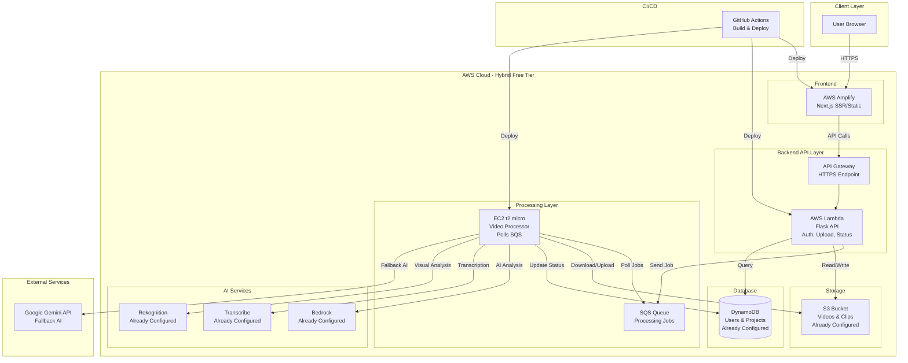
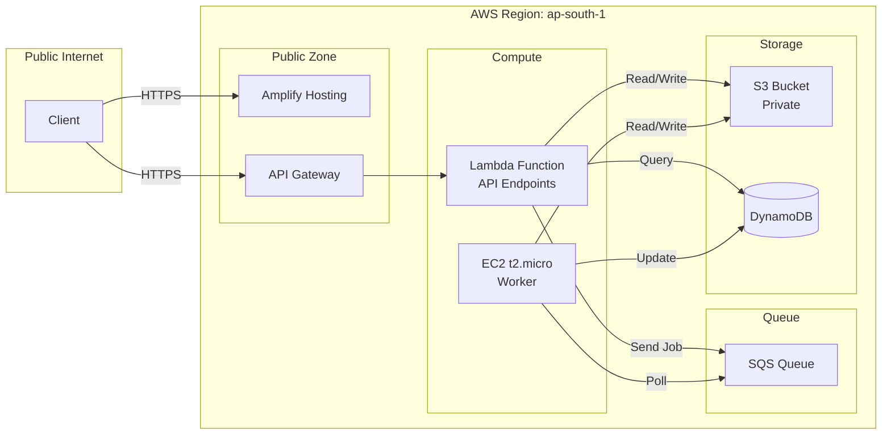

# Cloud Deployment Design Document

## Overview

This design document outlines the cloud deployment architecture for ClipSense, a full-stack video processing application. The system consists of a Flask backend with heavy ML dependencies (torch, whisper, mediapipe, moviepy) and a Next.js 14 frontend with TypeScript. The deployment leverages AWS services to provide scalable, reliable, and secure infrastructure.

### Key Design Decisions

1. **Backend API**: AWS Lambda with Lambda Web Adapter (Free Tier)
   - Rationale: Lambda provides 1M requests/month FREE FOREVER and 400,000 GB-seconds compute. Perfect for API endpoints (auth, upload, status). Scales automatically to handle unlimited concurrent users. Your Dockerfile already has Lambda Web Adapter configured.

2. **Video Processing Worker**: AWS EC2 t2.micro (Free Tier)
   - Rationale: EC2 provides 750 hours/month free for 12 months. Dedicated worker for long-running video processing (no 15-min timeout). Processes videos from SQS queue. Can run ML models (torch, whisper, mediapipe) without memory constraints.

3. **Message Queue**: AWS SQS (Free Tier)
   - Rationale: Decouples Lambda API from EC2 worker. Lambda sends processing jobs to queue, EC2 polls and processes. Free tier: 1M requests/month. Ensures no video processing is lost even if EC2 is temporarily down.

4. **Frontend Hosting**: AWS Amplify (Free Tier for Build, Paid for Hosting)
   - Rationale: Amplify provides best Next.js support with automatic CI/CD, HTTPS, and global CDN. Build minutes are free for public repos. Hosting costs ~$0.15/GB served (minimal for low traffic). Better than manual S3+CloudFront setup.

5. **Database**: DynamoDB (Already Implemented)
   - Rationale: Already integrated. Free tier: 25GB storage, 25 RCU/WCU. Permanent free tier (not just 12 months).

6. **Storage**: S3 (Already Implemented)
   - Rationale: Already integrated. Free tier: 5GB storage, 20,000 GET requests, 2,000 PUT requests/month.

7. **CI/CD**: GitHub Actions (Free for public repos)
   - Rationale: Free CI/CD with 2,000 minutes/month for private repos, unlimited for public repos.

### Architecture Diagram



## Architecture

### Service Selection and Justification

#### Backend API: AWS Lambda with Lambda Web Adapter (Free Tier)

Lambda is selected for API endpoints for the following reasons:

1. **Infinite Scaling**: Automatically scales to handle 1000s of concurrent users
2. **Free Tier**: 1M requests/month FREE FOREVER (not just 12 months)
3. **No Cold Start for API**: Lightweight API endpoints (auth, upload, status) start in <1 second
4. **Already Configured**: Your Dockerfile has Lambda Web Adapter ready to use
5. **Cost Efficient**: Pay only for actual requests, not idle time
6. **Managed**: No server management, automatic failover

**What Lambda Handles**:
- `/api/auth/*` - Authentication endpoints
- `/api/upload` - Receive file upload, save to S3, send job to SQS
- `/api/projects/*` - List, get, delete projects
- `/api/projects/<id>/status` - Check processing status
- `/api/clips/*` - Download clips (presigned URLs)
- `/api/health` - Health checks

**What Lambda Does NOT Handle**: Video processing (delegated to EC2 worker)

#### Video Processing Worker: AWS EC2 t2.micro (Free Tier)

EC2 t2.micro is selected ONLY for video processing:

1. **No Timeout**: Can process videos for hours without 15-min Lambda limit
2. **Persistent**: Always running, polls SQS queue for jobs
3. **ML Libraries**: Can load torch, whisper, mediapipe without cold start penalty
4. **Free Tier**: 750 hours/month free for 12 months (24/7 operation)
5. **Dedicated**: Processes one video at a time, no API traffic interference

**What EC2 Worker Handles**:
- Poll SQS queue for processing jobs
- Download video from S3
- Run transcription (Whisper or AWS Transcribe)
- Run AI analysis (Bedrock, Rekognition)
- Generate clips with moviepy
- Upload clips to S3
- Update project status in DynamoDB

**Scaling Strategy**:
- Start with 1 EC2 worker (free tier)
- If queue grows, add more EC2 instances (manual scaling)
- Or upgrade to AWS Batch for automatic scaling (costs apply)

#### Message Queue: AWS SQS (Free Tier)

SQS decouples Lambda API from EC2 worker:

1. **Free Tier**: 1M requests/month FREE FOREVER
2. **Reliability**: Messages persist until processed (no lost jobs)
3. **Decoupling**: Lambda returns immediately, EC2 processes async
4. **Visibility**: Track queue depth to monitor processing backlog

**Message Format**:
```json
{
  "projectId": "abc123",
  "userId": "user@example.com",
  "s3Uri": "s3://bucket/uploads/user/project/video.mp4",
  "settings": {
    "maxDuration": 15,
    "numClips": 3,
    "useSubs": true
  }
}
```

#### Frontend Hosting: AWS Amplify

Amplify is selected for frontend:

1. **Next.js Support**: Native SSR, ISR, and static export support
2. **Automatic CI/CD**: Deploys on git push, no manual steps
3. **Global CDN**: Built-in CloudFront distribution
4. **HTTPS**: Automatic SSL certificates
5. **Cost**: ~$0.15/GB served (minimal for low traffic, ~$1-5/month)

**Trade-off**: Not technically "free tier" but costs are minimal and worth the convenience vs manual S3+CloudFront setup.

#### Storage: Amazon S3 (Already Implemented)

The application already uses S3 for video uploads and generated clips:

1. **Already Integrated**: `aws_utils.py` has S3Storage class with upload/download/presigned URLs
2. **Free Tier**: 5GB storage, 20,000 GET requests, 2,000 PUT requests/month
3. **Configuration**: Uses ap-south-1 region with s3v4 signatures
4. **No Changes Needed**: Just need to ensure bucket exists and CORS is configured

#### Database: DynamoDB (Already Implemented)

The application already uses DynamoDB with MongoDB fallback:

1. **Already Integrated**: `db.py` has Database class supporting both DynamoDB and MongoDB
2. **Free Tier**: 25GB storage, 25 read/write capacity units
3. **Tables**: ClipSenseUsers and ClipSenseProjects
4. **No Changes Needed**: Just need to ensure tables exist with proper schemas

#### Secrets Management: Environment Variables

For free tier deployment, we'll use simple environment variables:

1. **EC2 Environment File**: Store secrets in `/etc/clipsense/.env` on EC2 instance
2. **File Permissions**: Restrict to root and application user only (chmod 600)
3. **No Additional Cost**: Free tier doesn't include Secrets Manager free usage
4. **Security**: EC2 security groups restrict access to instance

**Note**: For production, migrate to AWS Secrets Manager when budget allows.

### Network Architecture



**Security Considerations**:
- API Gateway provides HTTPS for Lambda API
- Amplify provides HTTPS for frontend
- EC2 security group allows NO inbound traffic (worker only polls SQS)
- SSH access only from specific IPs (for maintenance)
- S3 bucket blocks public access by default
- DynamoDB uses IAM authentication
- Lambda and EC2 use IAM roles for AWS service access (no credentials in code)
- Secrets stored in Lambda environment variables (encrypted at rest)

### Deployment Regions

**Primary Region**: ap-south-1 (Mumbai)
- Rationale: Matches the existing AWS_REGION configuration in the codebase
- Provides low latency for users in South Asia
- All AWS services (App Runner, S3, ECR, Secrets Manager) are available in this region

## Components and Interfaces

### Backend API Service (Lambda Function)

**Deployment Target**: AWS Lambda with Lambda Web Adapter

**Container Specification**:
- Base Image: `python:3.11-slim`
- Lambda Web Adapter: Already configured in Dockerfile
- Exposed Port: 5000 (Lambda Web Adapter forwards to Flask)
- Memory: 512MB (sufficient for API endpoints)
- Timeout: 30 seconds (API endpoints only, no processing)
- Environment Variables:
  - `PORT=5000`
  - `AWS_REGION=ap-south-1`
  - `AWS_S3_BUCKET=<bucket-name>`
  - `DYNAMO_USERS_TABLE=ClipSenseUsers`
  - `DYNAMO_PROJECTS_TABLE=ClipSenseProjects`
  - `SQS_QUEUE_URL=<queue-url>`
  - `GEMINI_API_KEY=<key>`
  - `JWT_SECRET_KEY=<secret>`
  - `GOOGLE_CLIENT_ID=<optional>`

**Lambda Configuration**:
- Runtime: Container image (using your existing Dockerfile)
- Handler: Not needed (Lambda Web Adapter handles it)
- IAM Role: Permissions for S3, DynamoDB, SQS (send messages)
- API Gateway: HTTP API for HTTPS endpoint

**Code Split Required**:
Create `lambda_api.py` - lightweight version of `server.py` with ONLY:
- Authentication endpoints
- Upload endpoint (saves to S3, sends SQS message)
- Project list/get/delete endpoints
- Status check endpoints
- Clip download endpoints (presigned URLs)

**Excluded from Lambda** (moved to EC2 worker):
- Video processing logic
- ML model loading (torch, whisper, mediapipe)
- Background threading

### Video Processing Worker (EC2 Service)

**Deployment Target**: EC2 t2.micro instance with Docker

**Container Specification**:
- Base Image: `python:3.11-slim`
- Memory: 1GB (t2.micro limit)
- CPU: 1 vCPU
- Environment Variables loaded from `/etc/clipsense/.env`:
  - `AWS_REGION=ap-south-1`
  - `AWS_S3_BUCKET=<bucket-name>`
  - `DYNAMO_PROJECTS_TABLE=ClipSenseProjects`
  - `SQS_QUEUE_URL=<queue-url>`
  - `GEMINI_API_KEY=<key>`

**EC2 Instance Configuration**:
- AMI: Amazon Linux 2023
- Instance Type: t2.micro (1 vCPU, 1GB RAM)
- Storage: 30GB EBS (free tier includes 30GB)
- Security Group:
  - Inbound: Port 22 (SSH from your IP only)
  - Outbound: All traffic
- IAM Role: Permissions for S3, DynamoDB, SQS (receive/delete), Bedrock, Transcribe, Rekognition

**Worker Script** (`worker.py`):
```python
# Polls SQS, processes videos, updates DynamoDB
while True:
    messages = sqs.receive_message(QueueUrl=queue_url, MaxNumberOfMessages=1)
    if messages:
        process_video_job(message)
        sqs.delete_message(QueueUrl=queue_url, ReceiptHandle=receipt_handle)
    time.sleep(5)
```

**Dockerfile for Worker**:
- Remove Lambda Web Adapter
- Remove Flask (not needed)
- Keep all ML dependencies
- Add worker.py as entrypoint

### Frontend Service (Next.js Application)

**Deployment Target**: AWS Amplify

**Build Configuration**:
- Framework: Next.js 14
- Build Command: `npm run build`
- Output: Hybrid SSR + Static (Amplify handles both)
- Deployment: Automatic on git push to main branch

**Environment Variables** (configured in Amplify):
- `NEXT_PUBLIC_API_URL`: API Gateway URL (https://xxxxxx.execute-api.ap-south-1.amazonaws.com)
- `NEXT_PUBLIC_AWS_REGION`: ap-south-1
- `NEXT_PUBLIC_S3_BUCKET`: S3 bucket name

**Amplify Configuration** (`amplify.yml`):
```yaml
version: 1
frontend:
  phases:
    preBuild:
      commands:
        - cd frontend
        - npm ci
    build:
      commands:
        - npm run build
  artifacts:
    baseDirectory: frontend/.next
    files:
      - '**/*'
  cache:
    paths:
      - frontend/node_modules/**/*
```

**Benefits over S3+CloudFront**:
- Automatic deployments on git push
- Built-in HTTPS and CDN
- Preview deployments for PRs
- No manual CloudFront invalidation needed

### Storage Service (S3)

**Already Implemented** - No changes needed to application code.

**Bucket Structure** (already in use):
```
{bucket-name}/
├── uploads/
│   └── {userId}/
│       └── {projectId}/
│           └── {filename}
└── clips/
    └── {userId}/
        └── {projectId}/
            └── {clipFilename}
```

**Bucket Configuration** (verify these settings):
- Encryption: AES-256 (SSE-S3)
- Versioning: Disabled
- Public Access: Blocked
- CORS: Configured to allow requests from CloudFront domain
- Region: ap-south-1

**CORS Configuration**:
```json
[
  {
    "AllowedHeaders": ["*"],
    "AllowedMethods": ["GET", "PUT", "POST", "DELETE"],
    "AllowedOrigins": ["https://*.cloudfront.net", "http://localhost:3000"],
    "ExposeHeaders": ["ETag"],
    "MaxAgeSeconds": 3000
  }
]
```

### Database Service (DynamoDB)

**Already Implemented** - Application code in `db.py` already supports DynamoDB.

**Tables** (need to be created):

1. **ClipSenseUsers**:
   - Primary Key: `email` (String)
   - Attributes: username, password, isVerified, otpCode, role, createdAt, etc.
   - Provisioned Capacity: 5 RCU, 5 WCU (free tier: 25 RCU/WCU total)

2. **ClipSenseProjects**:
   - Primary Key: `projectId` (String)
   - Attributes: userId, title, filename, s3Uri, s3Key, status, clips, etc.
   - Provisioned Capacity: 5 RCU, 5 WCU
   - GSI (optional): userId-index for querying user's projects

**Connection**:
- Uses boto3 DynamoDB resource
- IAM authentication via EC2 instance role
- No connection string needed (IAM handles auth)

**Backup**:
- Point-in-time recovery: Optional (costs extra)
- On-demand backups: Manual via AWS Console

### Secrets Management

**Deployment Approach**: Lambda Environment Variables (encrypted at rest)

**Lambda Environment Variables** (encrypted by AWS):
```bash
GEMINI_API_KEY=your-gemini-api-key
JWT_SECRET_KEY=your-jwt-secret
GOOGLE_CLIENT_ID=your-google-client-id
AWS_S3_BUCKET=clipsense-storage
DYNAMO_USERS_TABLE=ClipSenseUsers
DYNAMO_PROJECTS_TABLE=ClipSenseProjects
SQS_QUEUE_URL=https://sqs.ap-south-1.amazonaws.com/<account>/clipsense-processing-queue
AWS_REGION=ap-south-1
```

**EC2 Worker Environment File**: `/etc/clipsense/.env`
```bash
AWS_REGION=ap-south-1
AWS_S3_BUCKET=clipsense-storage
DYNAMO_PROJECTS_TABLE=ClipSenseProjects
SQS_QUEUE_URL=https://sqs.ap-south-1.amazonaws.com/<account>/clipsense-processing-queue
GEMINI_API_KEY=your-gemini-api-key
```

**Security Measures**:
- Lambda environment variables encrypted at rest by AWS
- EC2 file permissions: `chmod 600 /etc/clipsense/.env`
- IAM roles for AWS service access (no AWS credentials stored)
- Secrets not committed to Git
- EC2 security group restricts SSH to specific IPs

### Container Registry (ECR)

**Required for Lambda Deployment**

Lambda requires container images to be stored in ECR:

**Repository Configuration**:
- Repository Name: `clipsense-lambda-api`
- Image Tagging Strategy:
  - `latest`: Most recent build
  - `{git-sha}`: Specific commit for rollback
- Scan on Push: Disabled (to save time)
- Lifecycle Policy: Keep last 5 images

**Free Tier**:
- 500MB storage/month
- Unlimited data transfer to Lambda

**Image Optimization for Lambda**:
- Remove ML dependencies from Lambda image (torch, whisper, mediapipe)
- Keep only: Flask, boto3, pymongo, JWT, CORS
- Estimated size: ~200MB (fits in free tier)

**Separate Dockerfile for Lambda** (`Dockerfile.lambda`):
```dockerfile
FROM python:3.11-slim

COPY --from=public.ecr.aws/awsguru/aws-lambda-adapter:0.8.3 /lambda-adapter /opt/extensions/lambda-adapter

WORKDIR /app

# Minimal requirements for API only
COPY requirements-lambda.txt .
RUN pip install --no-cache-dir -r requirements-lambda.txt

COPY server.py lambda_api.py db.py aws_utils.py email_utils.py ./

ENV PORT=5000
CMD ["python", "lambda_api.py"]
```

## Data Models

### SQS Message Queue

**Queue Name**: `clipsense-processing-queue`

**Queue Configuration**:
- Type: Standard (free tier eligible)
- Visibility Timeout: 3600 seconds (1 hour - enough for video processing)
- Message Retention: 4 days
- Receive Wait Time: 20 seconds (long polling)
- Dead Letter Queue: Optional (for failed jobs)

**Message Structure**:
```json
{
  "projectId": "abc12345",
  "userId": "user@example.com",
  "s3Uri": "s3://bucket/uploads/user/project/video.mp4",
  "s3Key": "uploads/user/project/video.mp4",
  "settings": {
    "maxDuration": 15,
    "numClips": 3,
    "useSubs": true
  },
  "timestamp": "2024-01-15T10:30:00Z"
}
```

### Lambda API Function

**Function Configuration**:
```yaml
FunctionName: clipsense-api
Runtime: Container Image
ImageUri: <account-id>.dkr.ecr.ap-south-1.amazonaws.com/clipsense-lambda-api:latest
MemorySize: 512
Timeout: 30
Environment:
  Variables:
    AWS_REGION: ap-south-1
    AWS_S3_BUCKET: clipsense-storage
    DYNAMO_USERS_TABLE: ClipSenseUsers
    DYNAMO_PROJECTS_TABLE: ClipSenseProjects
    SQS_QUEUE_URL: https://sqs.ap-south-1.amazonaws.com/<account>/clipsense-processing-queue
    GEMINI_API_KEY: <encrypted>
    JWT_SECRET_KEY: <encrypted>
```

**API Gateway Configuration**:
```yaml
Type: HTTP API
Routes:
  - ANY /api/{proxy+}
Integration:
  Type: AWS_PROXY
  IntegrationUri: <lambda-arn>
CORS:
  AllowOrigins:
    - https://*.amplifyapp.com
  AllowMethods:
    - GET
    - POST
    - PUT
    - DELETE
    - OPTIONS
  AllowHeaders:
    - Authorization
    - Content-Type
```

### EC2 Worker Instance Setup

**User Data Script** (runs on first boot):
```bash
#!/bin/bash
# Update system
yum update -y

# Install Docker
yum install -y docker git
systemctl start docker
systemctl enable docker
usermod -a -G docker ec2-user

# Clone repository
cd /home/ec2-user
git clone https://github.com/your-username/clipsense.git
chown -R ec2-user:ec2-user clipsense

# Create secrets directory
mkdir -p /etc/clipsense
cat > /etc/clipsense/.env << EOF
AWS_REGION=ap-south-1
AWS_S3_BUCKET=clipsense-storage
DYNAMO_PROJECTS_TABLE=ClipSenseProjects
SQS_QUEUE_URL=https://sqs.ap-south-1.amazonaws.com/<account>/clipsense-processing-queue
GEMINI_API_KEY=your-key-here
EOF
chmod 600 /etc/clipsense/.env

# Build and run worker container
cd /home/ec2-user/clipsense/backend
docker build -f Dockerfile.worker -t clipsense-worker .
docker run -d \
  --name clipsense-worker \
  --restart unless-stopped \
  --env-file /etc/clipsense/.env \
  clipsense-worker

echo "ClipSense worker deployed successfully"
```

### IAM Roles

**Lambda Execution Role**: `ClipSenseLambdaRole`

**Trust Policy**:
```json
{
  "Version": "2012-10-17",
  "Statement": [{
    "Effect": "Allow",
    "Principal": {"Service": "lambda.amazonaws.com"},
    "Action": "sts:AssumeRole"
  }]
}
```

**Inline Policy**:
```json
{
  "Version": "2012-10-17",
  "Statement": [
    {
      "Effect": "Allow",
      "Action": [
        "logs:CreateLogGroup",
        "logs:CreateLogStream",
        "logs:PutLogEvents"
      ],
      "Resource": "arn:aws:logs:ap-south-1:*:*"
    },
    {
      "Effect": "Allow",
      "Action": [
        "s3:GetObject",
        "s3:PutObject",
        "s3:DeleteObject",
        "s3:ListBucket"
      ],
      "Resource": [
        "arn:aws:s3:::clipsense-storage",
        "arn:aws:s3:::clipsense-storage/*"
      ]
    },
    {
      "Effect": "Allow",
      "Action": [
        "dynamodb:GetItem",
        "dynamodb:PutItem",
        "dynamodb:UpdateItem",
        "dynamodb:DeleteItem",
        "dynamodb:Query",
        "dynamodb:Scan"
      ],
      "Resource": [
        "arn:aws:dynamodb:ap-south-1:*:table/ClipSenseUsers",
        "arn:aws:dynamodb:ap-south-1:*:table/ClipSenseProjects"
      ]
    },
    {
      "Effect": "Allow",
      "Action": [
        "sqs:SendMessage",
        "sqs:GetQueueUrl"
      ],
      "Resource": "arn:aws:sqs:ap-south-1:*:clipsense-processing-queue"
    }
  ]
}
```

**EC2 Instance Role**: `ClipSenseEC2WorkerRole`

**Trust Policy**:
```json
{
  "Version": "2012-10-17",
  "Statement": [{
    "Effect": "Allow",
    "Principal": {"Service": "ec2.amazonaws.com"},
    "Action": "sts:AssumeRole"
  }]
}
```

**Inline Policy**:
```json
{
  "Version": "2012-10-17",
  "Statement": [
    {
      "Effect": "Allow",
      "Action": [
        "s3:GetObject",
        "s3:PutObject",
        "s3:DeleteObject",
        "s3:ListBucket"
      ],
      "Resource": [
        "arn:aws:s3:::clipsense-storage",
        "arn:aws:s3:::clipsense-storage/*"
      ]
    },
    {
      "Effect": "Allow",
      "Action": [
        "dynamodb:GetItem",
        "dynamodb:UpdateItem",
        "dynamodb:Query"
      ],
      "Resource": "arn:aws:dynamodb:ap-south-1:*:table/ClipSenseProjects"
    },
    {
      "Effect": "Allow",
      "Action": [
        "sqs:ReceiveMessage",
        "sqs:DeleteMessage",
        "sqs:GetQueueAttributes"
      ],
      "Resource": "arn:aws:sqs:ap-south-1:*:clipsense-processing-queue"
    },
    {
      "Effect": "Allow",
      "Action": [
        "bedrock:InvokeModel"
      ],
      "Resource": "arn:aws:bedrock:ap-south-1::foundation-model/*"
    },
    {
      "Effect": "Allow",
      "Action": [
        "transcribe:StartTranscriptionJob",
        "transcribe:GetTranscriptionJob"
      ],
      "Resource": "*"
    },
    {
      "Effect": "Allow",
      "Action": [
        "rekognition:StartSegmentDetection",
        "rekognition:GetSegmentDetection"
      ],
      "Resource": "*"
    }
  ]
}
```

### Environment Configuration Model

**Configuration Hierarchy**:
1. IAM roles (AWS service access)
2. Lambda environment variables (API secrets)
3. EC2 environment file (worker secrets)
4. Application defaults (fallback values)

**Lambda Environment Variables**:
```bash
# AWS Configuration (IAM role handles credentials)
AWS_REGION=ap-south-1
AWS_S3_BUCKET=clipsense-storage
DYNAMO_USERS_TABLE=ClipSenseUsers
DYNAMO_PROJECTS_TABLE=ClipSenseProjects
SQS_QUEUE_URL=https://sqs.ap-south-1.amazonaws.com/<account>/clipsense-processing-queue

# Application Configuration
PORT=5000

# Secrets (encrypted by Lambda)
GEMINI_API_KEY=your-gemini-api-key-here
JWT_SECRET_KEY=your-jwt-secret-here
GOOGLE_CLIENT_ID=your-google-client-id-here
ADMIN_EMAIL=admin@clipsense.ai
```

**EC2 Worker Environment Variables** (`/etc/clipsense/.env`):
```bash
# AWS Configuration (IAM role handles credentials)
AWS_REGION=ap-south-1
AWS_S3_BUCKET=clipsense-storage
DYNAMO_PROJECTS_TABLE=ClipSenseProjects
SQS_QUEUE_URL=https://sqs.ap-south-1.amazonaws.com/<account>/clipsense-processing-queue

# Secrets
GEMINI_API_KEY=your-gemini-api-key-here
```

**Frontend Environment Variables** (configured in Amplify):
```bash
# Public variables (embedded in build)
NEXT_PUBLIC_API_URL=https://xxxxxx.execute-api.ap-south-1.amazonaws.com
NEXT_PUBLIC_AWS_REGION=ap-south-1
NEXT_PUBLIC_S3_BUCKET=clipsense-storage
```

### Deployment Pipeline Model

**GitHub Actions Workflow Structure**:

```yaml
# .github/workflows/deploy-lambda.yml
name: Deploy Lambda API

on:
  push:
    branches: [main]
    paths:
      - 'backend/**'
      - '.github/workflows/deploy-lambda.yml'

jobs:
  deploy:
    runs-on: ubuntu-latest
    
    steps:
      - name: Checkout code
        uses: actions/checkout@v4
      
      - name: Configure AWS credentials
        uses: aws-actions/configure-aws-credentials@v4
        with:
          aws-access-key-id: ${{ secrets.AWS_ACCESS_KEY_ID }}
          aws-secret-access-key: ${{ secrets.AWS_SECRET_ACCESS_KEY }}
          aws-region: ap-south-1
      
      - name: Login to Amazon ECR
        id: login-ecr
        uses: aws-actions/amazon-ecr-login@v2
      
      - name: Build and push Lambda image
        env:
          ECR_REGISTRY: ${{ steps.login-ecr.outputs.registry }}
          ECR_REPOSITORY: clipsense-lambda-api
          IMAGE_TAG: ${{ github.sha }}
        run: |
          cd backend
          docker build -f Dockerfile.lambda -t $ECR_REGISTRY/$ECR_REPOSITORY:$IMAGE_TAG .
          docker tag $ECR_REGISTRY/$ECR_REPOSITORY:$IMAGE_TAG $ECR_REGISTRY/$ECR_REPOSITORY:latest
          docker push $ECR_REGISTRY/$ECR_REPOSITORY:$IMAGE_TAG
          docker push $ECR_REGISTRY/$ECR_REPOSITORY:latest
      
      - name: Update Lambda function
        run: |
          aws lambda update-function-code \
            --function-name clipsense-api \
            --image-uri ${{ steps.login-ecr.outputs.registry }}/clipsense-lambda-api:latest
          
          # Wait for update to complete
          aws lambda wait function-updated \
            --function-name clipsense-api
      
      - name: Health check
        run: |
          sleep 10
          curl -f ${{ secrets.API_GATEWAY_URL }}/api/health || exit 1
```

```yaml
# .github/workflows/deploy-worker.yml
name: Deploy EC2 Worker

on:
  push:
    branches: [main]
    paths:
      - 'backend/**'
      - '.github/workflows/deploy-worker.yml'

jobs:
  deploy:
    runs-on: ubuntu-latest
    
    steps:
      - name: Checkout code
        uses: actions/checkout@v4
      
      - name: Deploy to EC2 Worker
        uses: appleboy/ssh-action@master
        with:
          host: ${{ secrets.EC2_WORKER_HOST }}
          username: ec2-user
          key: ${{ secrets.EC2_SSH_KEY }}
          script: |
            cd /home/ec2-user/clipsense
            git pull origin main
            cd backend
            docker build -f Dockerfile.worker -t clipsense-worker .
            docker stop clipsense-worker || true
            docker rm clipsense-worker || true
            docker run -d \
              --name clipsense-worker \
              --restart unless-stopped \
              --env-file /etc/clipsense/.env \
              clipsense-worker
            sleep 5
            docker logs clipsense-worker --tail 20
```

```yaml
# .github/workflows/deploy-frontend.yml
name: Deploy Frontend to Amplify

on:
  push:
    branches: [main]
    paths:
      - 'frontend/**'

# Amplify auto-deploys on push, this workflow is optional
jobs:
  notify:
    runs-on: ubuntu-latest
    steps:
      - name: Notify deployment
        run: echo "Amplify will auto-deploy frontend"
```

## 

## Error Handling

### Backend Error Handling

**Application-Level Errors**:

1. **Video Processing Failures**:
   - Catch exceptions during transcription, analysis, or rendering
   - Update project status to "error" with descriptive error message
   - Log full stack trace to CloudWatch
   - Send error notification email to user (optional)
   - Clean up temporary files and partial uploads

2. **S3 Upload Failures**:
   - Retry logic: 3 attempts with exponential backoff
   - Fallback to local storage if S3 is unavailable
   - Return appropriate HTTP status code (500 for server error, 503 for service unavailable)

3. **MongoDB Connection Failures**:
   - Connection pooling with automatic reconnection
   - Health check endpoint returns 503 if database is unreachable
   - Graceful degradation: cache recent data in memory if possible

4. **External API Failures** (Gemini, Whisper):
   - Timeout configuration: 30 seconds for API calls
   - Retry with exponential backoff for transient failures
   - Return user-friendly error messages
   - Log API errors for debugging

**HTTP Error Responses**:
```python
{
  "error": "Human-readable error message",
  "code": "ERROR_CODE",
  "details": {
    "field": "Additional context"
  }
}
```

**Error Codes**:
- `UPLOAD_FAILED`: File upload to S3 failed
- `PROCESSING_FAILED`: Video processing pipeline failed
- `INVALID_FORMAT`: Unsupported file format
- `QUOTA_EXCEEDED`: User exceeded usage limits
- `AUTH_FAILED`: Authentication or authorization failed
- `DB_ERROR`: Database operation failed
- `EXTERNAL_API_ERROR`: External service (Gemini, etc.) failed

### Infrastructure Error Handling

**App Runner Health Checks**:
- Endpoint: `/api/health`
- Interval: 30 seconds
- Timeout: 5 seconds
- Unhealthy threshold: 3 consecutive failures
- Action: Automatic container restart

**Health Check Response**:
```json
{
  "status": "ok",
  "service": "clipsense-api",
  "engineReady": true,
  "dbReady": true,
  "geminiKeySet": true,
  "timestamp": "2024-01-15T10:30:00Z"
}
```

**Deployment Failures**:
- GitHub Actions workflow fails if:
  - Docker build fails
  - ECR push fails
  - Health check fails after deployment
- Rollback strategy: App Runner keeps previous version running if new deployment fails
- Notification: GitHub Actions sends failure notification to repository

**Monitoring and Alerting**:
- CloudWatch Alarms for:
  - App Runner CPU > 80% for 5 minutes
  - App Runner memory > 90% for 5 minutes
  - Health check failures > 3 in 5 minutes
  - 5xx error rate > 5% for 5 minutes
- SNS topic for alarm notifications
- Email or Slack integration for critical alerts

### Frontend Error Handling

**API Call Failures**:
```typescript
async function apiCall(endpoint: string, options: RequestInit) {
  try {
    const response = await fetch(`${API_URL}${endpoint}`, {
      ...options,
      headers: {
        'Authorization': `Bearer ${token}`,
        'Content-Type': 'application/json',
        ...options.headers
      }
    });
    
    if (!response.ok) {
      const error = await response.json();
      throw new Error(error.message || 'Request failed');
    }
    
    return await response.json();
  } catch (error) {
    console.error('API call failed:', error);
    // Show user-friendly error message
    toast.error('Something went wrong. Please try again.');
    throw error;
  }
}
```

**Network Failures**:
- Retry logic for transient network errors
- Offline detection and user notification
- Queue failed requests for retry when connection restored

**Build Failures**:
- Amplify build logs available in AWS Console
- Build failure notifications via email
- Previous successful deployment remains live

## Testing Strategy

### Unit Testing

**Backend Unit Tests**:
- Framework: pytest
- Coverage target: >80% for core business logic
- Test files: `backend/tests/test_*.py`

**Test Categories**:
1. **API Endpoint Tests**: Test each Flask route with various inputs
2. **AWS Integration Tests**: Mock boto3 calls, test S3 upload/download logic
3. **Database Tests**: Mock MongoDB operations, test CRUD functions
4. **Authentication Tests**: Test JWT generation, validation, and role-based access
5. **Video Processing Tests**: Test clip metadata generation (mock heavy ML operations)

**Example Unit Test**:
```python
def test_health_endpoint(client):
    """Test that health endpoint returns 200 with correct structure"""
    response = client.get('/api/health')
    assert response.status_code == 200
    data = response.get_json()
    assert 'status' in data
    assert 'engineReady' in data
    assert 'dbReady' in data
```

**Frontend Unit Tests**:
- Framework: Jest + React Testing Library
- Coverage target: >70% for components and utilities
- Test files: `frontend/src/**/*.test.tsx`

**Test Categories**:
1. **Component Tests**: Test React component rendering and interactions
2. **API Client Tests**: Test API wrapper functions with mocked responses
3. **Utility Tests**: Test helper functions and data transformations
4. **Authentication Tests**: Test login flow and token management

### Property-Based Testing

Property-based tests will be implemented using:
- **Backend**: Hypothesis (Python)
- **Frontend**: fast-check (TypeScript)

**Configuration**:
- Minimum 100 iterations per property test
- Each test tagged with reference to design document property
- Tag format: `# Feature: cloud-deployment, Property {number}: {property_text}`

**Property Test Categories**:
1. **Infrastructure Properties**: Verify Terraform configurations produce valid AWS resources
2. **API Contract Properties**: Verify API responses match OpenAPI schema for all inputs
3. **Storage Properties**: Verify S3 operations maintain data integrity
4. **Authentication Properties**: Verify JWT tokens are valid and secure

### Integration Testing

**Backend Integration Tests**:
- Test complete workflows: upload → process → download
- Use test MongoDB instance
- Use LocalStack for AWS service mocking (S3, Secrets Manager)
- Run in CI pipeline before deployment

**Frontend Integration Tests**:
- Framework: Playwright or Cypress
- Test user flows: login → upload → view results
- Mock backend API responses
- Run in CI pipeline

### End-to-End Testing

**Staging Environment Tests**:
- Deploy to staging environment before production
- Run automated E2E tests against staging
- Test scenarios:
  1. User registration and login
  2. Video upload and processing
  3. Clip download
  4. Error handling (invalid file, network failure)
- Manual QA for UI/UX validation

**Load Testing**:
- Tool: Apache JMeter or Locust
- Scenarios:
  - 100 concurrent users uploading videos
  - 1000 requests/minute to API endpoints
- Metrics:
  - Response time < 2s for 95th percentile
  - Error rate < 1%
  - App Runner auto-scaling behavior

### Deployment Testing

**Health Check Validation**:
- Automated health check after each deployment
- Verify all dependencies (DynamoDB, S3, AWS AI services) are accessible
- Fail deployment if health check fails

**Smoke Tests**:
- SSH into EC2 and run: `curl http://localhost:5000/api/health`
- Test authentication endpoint
- Test upload endpoint with small test file
- Verify CloudFront serves frontend correctly

**Monitoring**:
- CloudWatch Logs for application logs (optional, costs apply after free tier)
- EC2 instance monitoring via AWS Console
- Manual log checking via SSH: `docker logs clipsense`


## Correctness Properties

*A property is a characteristic or behavior that should hold true across all valid executions of a system—essentially, a formal statement about what the system should do. Properties serve as the bridge between human-readable specifications and machine-verifiable correctness guarantees.*

### Property Reflection

After analyzing all acceptance criteria, I identified the following redundancies and consolidations:

**Redundancies Eliminated**:
1. Properties 1.2 and 7.2 both test that images are stored with version tags in ECR - consolidated into Property 1
2. Properties 1.8 and 5.4 both test that configuration is loaded at startup - consolidated into Property 2
3. Properties 8.2 and 8.3 both test health check dependency verification - consolidated into Property 11
4. Properties 3.4 and 9.4 both test S3 security configuration - consolidated into example tests
5. Properties 2.2 and 9.1 both test HTTPS enforcement - consolidated into Property 4

**Properties Combined**:
1. Properties about health check responses (8.4, 8.5) combined into Property 12
2. Properties about deployment pipeline behavior (7.6, 7.7) combined into Property 15

This reflection ensures each property provides unique validation value without logical redundancy.

### Property 1: ECR Image Versioning

*For any* Docker image pushed to the Container Registry, the image SHALL be stored with its version tag and be retrievable using that tag.

**Validates: Requirements 1.2, 7.2**

### Property 2: Configuration Loading at Startup

*For any* required configuration key (GEMINI_API_KEY, MONGODB_URI, JWT_SECRET_KEY, AWS_S3_BUCKET, AWS_REGION), when the Backend_Service starts, it SHALL successfully load the value from either AWS Secrets Manager or environment variables.

**Validates: Requirements 1.8, 5.4**

### Property 3: Python Dependencies in Container

*For any* package listed in requirements.txt, the built Docker image SHALL contain that package and it SHALL be importable within the running container.

**Validates: Requirements 1.3**

### Property 4: HTTPS Enforcement

*For any* HTTP request to the Frontend_Hosting URL, the request SHALL be automatically redirected to HTTPS or served over HTTPS with a valid TLS certificate.

**Validates: Requirements 2.2, 9.1**

### Property 5: Frontend Response Time

*For any* request to the root URL of the Frontend_Hosting, the response SHALL be received within 2 seconds under normal load conditions.

**Validates: Requirements 2.3**

### Property 6: Client-Side Routing Support

*For any* valid Next.js route in the application, navigating directly to that route via URL SHALL return the correct page content without 404 errors.

**Validates: Requirements 2.5**

### Property 7: Static Asset Caching

*For any* static asset (JS, CSS, images) served by the Frontend_Hosting, the HTTP response SHALL include cache-control headers with an appropriate max-age value.

**Validates: Requirements 2.6**

### Property 8: S3 Upload Integrity

*For any* video file uploaded to Storage_Service, the file SHALL be retrievable from S3 and its content SHALL match the original uploaded file (verified by checksum or byte comparison).

**Validates: Requirements 3.2**

### Property 9: Presigned URL Validity

*For any* object stored in S3, generating a presigned URL SHALL produce a URL that is valid for exactly 3600 seconds and allows GET access to the object during that time period.

**Validates: Requirements 3.3**

### Property 10: S3 Object Cleanup

*For any* project with associated S3 objects (uploads and clips), when the project is deleted, all objects with the project's prefix SHALL be removed from S3.

**Validates: Requirements 3.6**

### Property 11: Health Check Dependency Verification

*For any* health check request to /api/health, the Backend_Service SHALL verify connectivity to both Database_Service (MongoDB) and Storage_Service (S3) before returning a response.

**Validates: Requirements 8.2, 8.3**

### Property 12: Health Check Response Format

*For any* health check request, IF all dependencies are healthy THEN the response SHALL be HTTP 200 with status "healthy", ELSE IF any dependency is unhealthy THEN the response SHALL be HTTP 503 with error details indicating which dependency failed.

**Validates: Requirements 8.4, 8.5**

### Property 13: Backend API Response Time

*For any* non-processing API endpoint (excluding /api/projects/*/process), when the Backend_Service receives a valid HTTP request, it SHALL respond within 30 seconds.

**Validates: Requirements 1.7**

### Property 14: MongoDB Connection Establishment

*For any* valid MongoDB connection string, when the Backend_Service starts, the connection to Database_Service SHALL be established within 10 seconds.

**Validates: Requirements 4.3**

### Property 15: Deployment Pipeline Health Validation

*For any* deployment (backend or frontend), the Deployment_Pipeline SHALL run health checks after deployment completes, and IF health checks fail THEN the pipeline SHALL report deployment failure with exit code non-zero.

**Validates: Requirements 7.6, 7.7**

### Property 16: Backend Deployment Auto-Update

*For any* new Docker image pushed to ECR with the 'latest' tag, the Backend_Compute (App Runner) SHALL automatically pull and deploy the new image within 5 minutes.

**Validates: Requirements 7.5**

### Property 17: Frontend Environment Variable Isolation

*For any* environment variable accessed in the Frontend_Service code, the variable name SHALL start with the prefix "NEXT_PUBLIC_" to ensure it's safe for client-side exposure.

**Validates: Requirements 5.5**

### Property 18: Infrastructure Code Secret Scanning

*For any* Terraform file in the Infrastructure_Code, the file SHALL NOT contain hardcoded secrets matching patterns for API keys, passwords, or credentials (e.g., strings matching /[A-Za-z0-9]{32,}/ that look like keys).

**Validates: Requirements 5.6**

### Property 19: Configuration Update Propagation

*For any* configuration value stored in AWS Secrets Manager, when the value is updated and the Backend_Service is restarted, the service SHALL use the new value in subsequent operations.

**Validates: Requirements 5.7**

### Property 20: IAM Least Privilege

*For any* IAM role defined in the Infrastructure_Code, the role's policy SHALL grant only the minimum permissions required for its function (e.g., App Runner instance role should have S3 and Secrets Manager access but not EC2 or RDS permissions).

**Validates: Requirements 6.6**

### Property 21: Terraform Deployment Time

*For any* valid Terraform configuration, running `terraform apply` SHALL complete resource creation in under 15 minutes.

**Validates: Requirements 6.8**

### Property 22: Backend Deployment Time

*For any* backend code change that triggers the Deployment_Pipeline, the complete deployment process (build, push, deploy, health check) SHALL complete in under 10 minutes.

**Validates: Requirements 7.8**

### Property 23: Frontend Deployment Time

*For any* frontend code change that triggers the Deployment_Pipeline, the complete deployment process (build, deploy) SHALL complete in under 5 minutes.

**Validates: Requirements 7.9**

### Property 24: CORS Origin Validation

*For any* HTTP request to the Backend_Service from an origin other than the Frontend_Hosting domain, IF the request is a cross-origin request THEN it SHALL be rejected unless the origin is explicitly whitelisted in the CORS configuration.

**Validates: Requirements 9.2**

### Property 25: JWT Authentication Enforcement

*For any* authenticated API endpoint (endpoints requiring @jwt_required decorator), requests without a valid JWT token SHALL be rejected with HTTP 401 Unauthorized.

**Validates: Requirements 9.6**

### Property 26: Documentation Environment Variable Completeness

*For any* environment variable or secret used in the Backend_Service or Frontend_Service code, the deployment documentation SHALL include an entry describing that variable, its purpose, and where it should be configured.

**Validates: Requirements 10.3**

### Property 27: Health Endpoint Startup Time

*For any* Backend_Service container start, the Health_Endpoint at /api/health SHALL return HTTP 200 within 30 seconds of the container starting.

**Validates: Requirements 1.5**

### Property 28: Server-Side Encryption Enforcement

*For any* object uploaded to the Storage_Service S3 bucket, the object SHALL be encrypted at rest using server-side encryption (verified by checking object metadata for encryption status).

**Validates: Requirements 3.4**

### Property 29: Frontend Build Artifact Deployment

*For any* successful frontend build, the Deployment_Pipeline SHALL deploy the Build_Artifact to Frontend_Hosting and the deployed application SHALL be accessible via the Amplify URL.

**Validates: Requirements 7.4**

